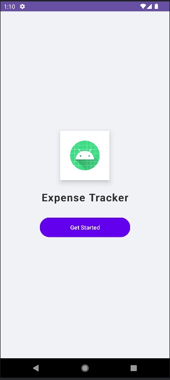

# 📱 Expense Tracker App

A simple and user-friendly Android application to manage daily expenses efficiently.

---

## 🎓 Academic Project
Developed as part of **4th Semester Mobile Application Development Lab**.

---

## ✨ Features
- ➕ Add expenses with title, amount, and category  
- 📋 View all expenses in a clean list  
- 🗑️ Delete expense using long press  
- 📊 Total expense summary screen  
- 🎨 Clean and modern UI design  

---

## 🛠️ Tech Stack
- Java  
- Android Studio  
- SQLite Database  

---

## 📸 Screenshots

  
  

---

## 🎯 Objective
To understand Android app development and implement real-world features like data storage, UI design, and user interaction.

---

## 👨‍💻 Developer
**Gaurav Kevat**
